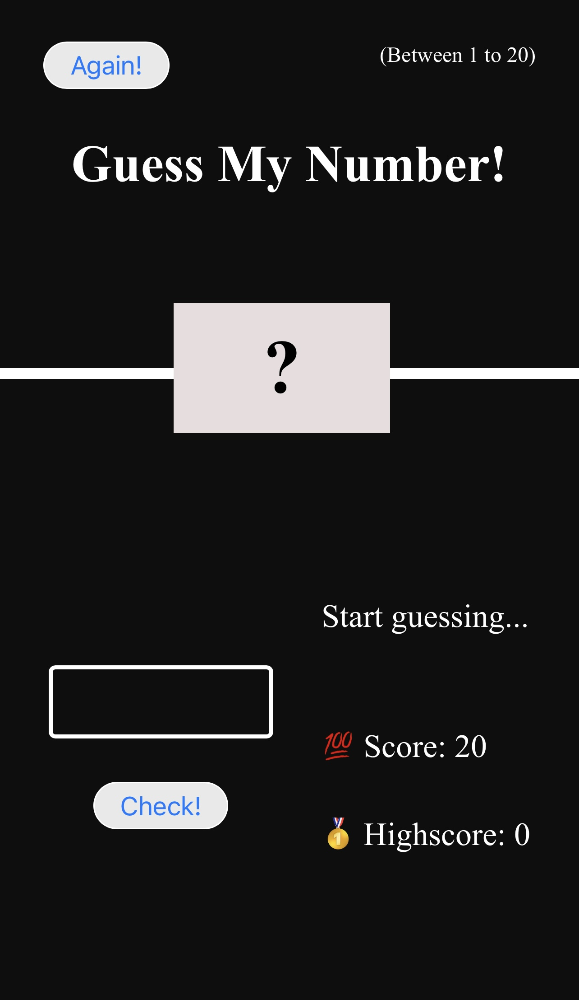

# Guess My Number Game 🎯

An interactive number guessing game built with **HTML**, **CSS**, and **JavaScript**.

## 🔧 Technologies Used
- HTML5
- CSS3
- JavaScript (ES6+)

## 📱 Features
- Real-time feedback with DOM manipulation
- Random number generation
- Score and high-score tracking
- Responsive layout

## 📷 Preview
🔗 [Live Site](https://chellyy01.github.io/Guess-My-Number/)

🖼️

## 📂 How to Use
1. Clone the repository
2. Open `index.html` in your browser
3. Guess a number between 1 and 20 and beat your high score!

## 🙋‍♀️ Author
Marypauline Ibute  
GitHub: 🔗 [Chellyy01](https://github.com/Chellyy01)
